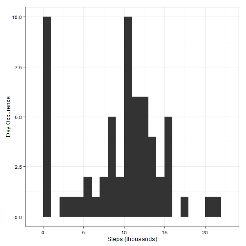
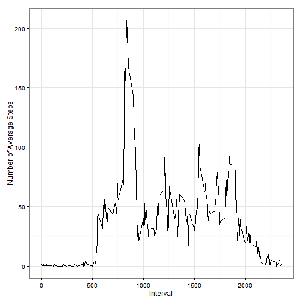
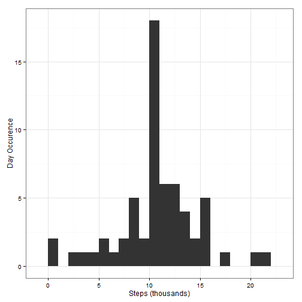
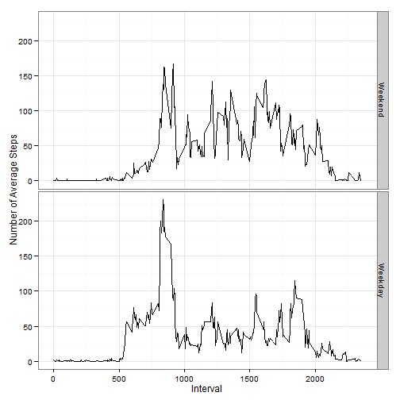

# Reproducible Research: Peer Assessment 1

### Load required packages

```r
library(dplyr)
library(ggplot2)
```

## Loading and preprocessing the data

```r
if(!file.exists("activity.csv"))
  unzip("activity.zip")

activityDF <- read.csv("activity.csv") %>%
  mutate(date = as.Date(date, "%Y-%m-%d"))
str(activityDF)
```

```
## 'data.frame':	17568 obs. of  3 variables:
##  $ steps   : int  NA NA NA NA NA NA NA NA NA NA ...
##  $ date    : Date, format: "2012-10-01" "2012-10-01" ...
##  $ interval: int  0 5 10 15 20 25 30 35 40 45 ...
```


## What is mean total number of steps taken per day? {#actPerDay}

```r
actPerDay <- activityDF %>%
  group_by(date) %>%
  summarise(steps = sum(steps, na.rm = TRUE))

ggplot(actPerDay, aes(steps/1e3)) +
  geom_histogram(binwidth = 1) +
  theme_bw() +
  labs(x = "Steps (thousands)",
       y = "Day Occurence")
```

 

```r
summarise(actPerDay, mean(steps), median(steps))
```

```
## Source: local data frame [1 x 2]
## 
##   mean(steps) median(steps)
## 1        9354         10395
```


## What is the average daily activity pattern?

```r
actPerInt <- activityDF %>%
  group_by(interval) %>%
  summarise(steps = mean(steps, na.rm = TRUE))

ggplot(actPerInt, aes(interval, steps)) +
  geom_line() + 
  theme_bw() +
  labs(x = "Interval",
       y = "Number of Average Steps")
```

 

```r
actPerInt$interval[ which.max(actPerInt$steps) ]
```

```
## [1] 835
```

## Imputing missing values

```r
sum(is.na(activityDF$steps))
```

```
## [1] 2304
```

We are going to impute these missing values using average steps by interval.


```r
imputedDF <- activityDF %>%
  left_join(actPerInt, by = "interval") %>%
  mutate(steps = ifelse(is.na(steps.x), steps.y, steps.x))
```


```r
imputedActByDay <- imputedDF %>%
  group_by(date) %>%
  summarise(steps = sum(steps))

ggplot(imputedActByDay, aes(steps/1e3)) +
  geom_histogram(binwidth = 1) +
  theme_bw() +
  labs(x = "Steps (thousands)",
       y = "Day Occurence")
```

 

```r
summarise(imputedActByDay, mean(steps), median(steps))
```

```
## Source: local data frame [1 x 2]
## 
##   mean(steps) median(steps)
## 1       10766         10766
```

The histogram overall is very similar to the one we generated [earlier](#actPerDay), execept that we have far less days falling into the zero steps bucket. This makes sense because we imputed `NA` with interval average, which shifted mean up quite a bit while kept median roughly the same.

## Are there differences in activity patterns between weekdays and weekends?

```r
partitionedDF <- imputedDF %>%
  mutate(weekday = as.POSIXlt(date)$wday) %>%
  mutate(weekday = weekday > 0 & weekday < 6) %>%
  mutate(weekday = factor(weekday, labels = c("Weekend", "Weekday"))) %>%
  group_by(weekday, interval) %>%
  summarise(steps = mean(steps))

###ggvis doesn't have subplot just yet :(
ggplot(partitionedDF, aes(interval, steps)) +
  geom_line() +
  facet_grid(weekday ~ .) +
  theme_bw() +
  labs(x = "Interval",
       y = "Number of Average Steps")
```

 
